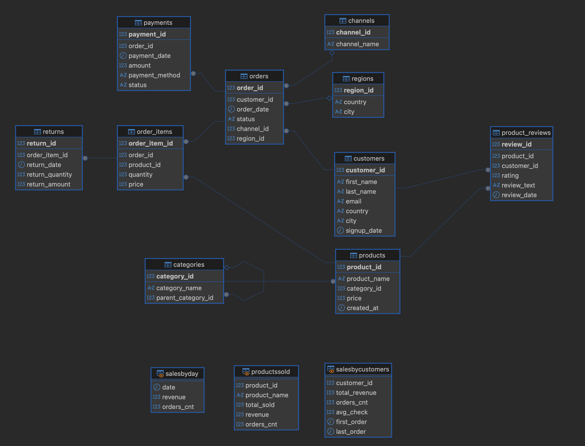

# sales-analytics-project

# 📊 Sales Analytics Platform

## 📌 Описание проекта

Данный проект представляет собой аналитическую систему для анализа продаж, реализованную на базе PostgreSQL.

Цель проекта — спроектировать реляционную базу данных, построить витрины данных (views) и выполнить анализ ключевых бизнес-показателей: выручки, клиентов и товаров.

---

## 🧱 Структура базы данных

База данных построена по реляционной модели и включает следующие сущности:

### 👤 Клиенты и заказы

* **customers** — информация о клиентах
* **orders** — заказы клиентов
* **order_items** — позиции заказов

### 🛍 Товары и категории

* **products** — товары
* **categories** — категории товаров (поддерживается иерархия через parent_category_id)

### 💳 Финансовые операции

* **payments** — информация об оплатах
* **returns** — возвраты товаров

### 🌍 Дополнительные сущности

* **regions** — география заказов
* **channels** — каналы продаж
* **product_reviews** — отзывы клиентов о товарах

Связи между таблицами реализованы через внешние ключи, обеспечивая целостность данных.

---

## 🗺 ER-диаграмма

Ниже представлена ER-диаграмма базы данных, отражающая основные сущности проекта и связи между ними.

## ⚙️ Развёртывание проекта

Для воспроизведения базы данных необходимо выполнить SQL-скрипты в следующем порядке:

1. `ddl/create_tables.sql` — создание таблиц базы данных.
2. Файлы с тестовыми данными из каталога `dml/` — загрузка исходных данных в таблицы в порядке нумерации:
   1. `dml/01. regions`
   2. `dml/02. channels`
   3. `dml/03. categories`
   4. `dml/04. customers`
   5. `dml/05. products`
   6. `dml/06. orders`
   7. `dml/07. order_items`
   8. `dml/08. payments`
   9. `dml/09. returns`
   10. `dml/10. product_reviews`
3. `views/views.sql` — создание аналитических представлений.
4. `analytics/segment.sql` — создание логики сегментации клиентов.
5. `analytics/zaprosi.sql` — выполнение аналитических SQL-запросов.
6. `reports/otchety.sql` — выполнение запросов для аналитических отчётов.

---

## 🧠 Аналитические запросы

В рамках проекта были разработаны аналитические SQL-запросы для извлечения и анализа данных.

Основные задачи:

* 📊 Расчёт выручки с учётом возвратов
* 📈 Анализ динамики продаж по времени (с использованием оконных функций)
* 👤 Анализ поведения клиентов (выручка, средний чек, частота заказов)
* 📦 Анализ эффективности товаров (продажи, выручка, доля в общем объёме)
* 🔄 Построение сегментации клиентов

Использованные техники:

* агрегатные функции (`SUM`, `AVG`, `COUNT`)
* оконные функции (`LAG`, `RANK`, `NTILE`)
* CTE (Common Table Expressions)
* JOIN для объединения данных
* обработка NULL значений (`COALESCE`)

Данные запросы легли в основу витрин данных и аналитических отчётов.

---

## 🧩 Представления (Views)

В проекте реализованы витрины данных для упрощения аналитики и повторного использования логики расчётов.

### 📅 salesbyday

Агрегирует выручку и количество заказов по дням.

Особенности:

* учитываются только заказы со статусом `<> 'cancelled'`
* возвраты предварительно агрегируются для предотвращения дублирования
* выручка рассчитывается как сумма продаж за вычетом возвратов

---

### 👤 salesbycustomers

Содержит агрегированные метрики по клиентам:

* total_revenue — суммарная выручка
* orders_cnt — количество заказов
* avg_check — средний чек
* first_order / last_order — даты активности

Особенности:

* расчёт производится на уровне заказа с последующей агрегацией по клиенту
* используется двухуровневая агрегация (order → customer)
* возвраты корректно учитываются в выручке

---

### 📦 productssold

Аналитика по товарам:

* total_sold — количество проданных единиц
* revenue — выручка с учётом возвратов
* orders_cnt — количество заказов

Особенности:

* учитываются только заказы со статусом `<> 'cancelled'`
* возвраты агрегируются отдельно и вычитаются из выручки
* данные агрегируются на уровне продукта

---

### 🧠 customer_segments_summary

Агрегированная сегментация клиентов по уровню выручки.

Особенности:

* используется оконная функция `NTILE`
* клиенты делятся на 3 сегмента:

  * VIP — наиболее прибыльные
  * Middle — средний сегмент
  * Low — наименее прибыльные
* сегментация динамическая и не зависит от фиксированных порогов

---

## 📈 Аналитические отчёты

### 1. Динамика выручки

Анализ изменения выручки по дням с использованием оконной функции `lag`.

**Выводы:**

* Выручка не демонстрирует устойчивого роста и подвержена колебаниям
* Наблюдаются периоды как увеличения, так и снижения показателя
* Это может свидетельствовать о нестабильном спросе

---

### 2. Топ товаров

Определение наиболее прибыльных товаров и их доли в общей выручке.

**Выводы:**

* Основная часть выручки сосредоточена в ограниченном числе товаров
* Топ-товары являются ключевыми драйверами продаж
* Структура продаж соответствует принципу Парето

---

## 🧠 Сегментация клиентов

Клиенты сегментированы по уровню выручки с использованием оконной функции `NTILE`.

Данный подход позволяет:

* автоматически распределять клиентов по группам
* избегать жёстко заданных порогов
* корректно работать с любым объёмом данных

---

## ⚙️ Методы оптимизации

В процессе разработки были применены следующие подходы:

* агрегация возвратов в отдельных подзапросах для предотвращения дублирования данных
* использование CTE (Common Table Expressions) для повышения читаемости запросов
* применение оконных функций (`lag`, `rank`, `ntile`)
* использование представлений (views) для повторного использования логики

---

## ℹ️ Дополнительно

Хранимые процедуры и функции не использовались, так как проект ориентирован на аналитическую обработку данных.

---

## 🚀 Итог

В рамках проекта была разработана аналитическая модель данных, реализованы витрины данных и выполнен анализ ключевых бизнес-показателей.

Проект демонстрирует навыки работы с SQL, проектирования баз данных и проведения бизнес-анализа.
